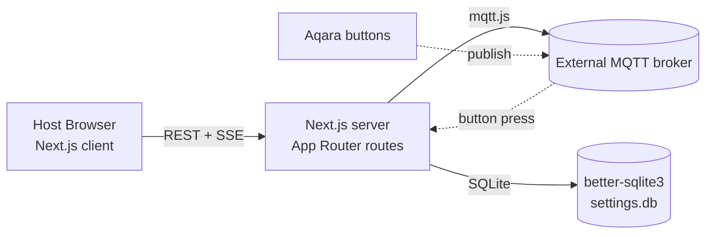

# 01 — Product & Architecture Overview

## Goals

- Let a single host run a board-game session in which every player has a clock.
- Support two timer disciplines that cover the common cases: a single budget per player for the whole game, or a fixed per-turn limit.
- Support both on-screen tapping and physical (Aqara-style MQTT) buttons to end a turn, so the host's hands stay on the host screen even when players sit far from it.
- Provide unambiguous, recoverable in-game controls (pause/resume, undo last turn switch, per-player time adjustment) so honest mistakes do not ruin a session.

## Non-goals (v1)

- **No multi-device UI.** No remote viewer page, no per-player screen. The host's screen is the only client.
- **No authentication / accounts.** The app assumes it runs on a trusted local network.
- **No persistent game history.** Past sessions are not stored; only app settings persist.
- **No internationalization.** UI is English-only.
- **No offline mode for the broker.** Physical-button mode degrades to screen-tap if the broker is unreachable; no offline buffering of button presses.
- **No "skip player" control.** Out of scope; use Adjust Time or Undo instead.
- **No automatic turn-by-turn advancement on timeout.** Even in turn-by-turn mode, the host advances manually; the timer just alerts.

## Personas

- **Host.** The single user of the app. Operates the host screen, manages configuration, presses control buttons. Has full authority over the session.
- **Players.** Do not interact with the app directly. May hold an assigned physical button if `endOfTurnTrigger = physical-button`. Otherwise their only interaction is watching the host screen.

## High-level architecture

- The **host browser** runs a Next.js React client. It issues REST calls for every action and listens to a single SSE stream for live state updates.
- The **Next.js server** owns the authoritative `GameState` in memory and the persistent `AppSettings` in SQLite. It is also the MQTT client.
- The **MQTT broker** is external. The app does not embed a broker. Buttons publish to the broker; the server subscribes and translates qualifying messages into `EndTurn` events.
- **Game state is in-memory only.** A server restart loses any in-progress game (see `09-persistence.md`).

## Tech stack decisions

| Decision | Choice | Rationale |
| --- | --- | --- |
| Frontend + backend | **Next.js (App Router) + TypeScript** | Single deployable unit; SSR not required but App Router gives clean route layout and route handlers for the REST surface. TS is mandatory for the typed contracts in `05-data-model.md`. |
| Realtime transport | **Server-Sent Events (SSE)** | Communication is one-way server→client (timer ticks, phase changes). REST handles all client→server actions. SSE has lower complexity than WebSocket and survives proxies/CDNs better. |
| MQTT client | **`mqtt.js` v5** | De-facto Node.js MQTT library; supports v3.1.1 and v5 brokers, auto-reconnect, TLS. Runs in a singleton on the server. |
| Settings persistence | **`better-sqlite3`** | Synchronous, atomic, zero-config; preferred over a JSON file because writes are transactional and concurrent reads are safe. Singleton-row pattern keeps the schema trivial. |
| Game state | **In-process JavaScript object** | Scope is a single session at a time; durability across restarts is explicitly out of scope (see `09-persistence.md`). |
| Styling | Implementation choice (Tailwind or CSS Modules) | Not constrained by spec; pick what the implementer prefers. UI structure is specified in `08-ui-screens.md`. |
| Process model | Single Node.js process | Means the singleton in-memory state is safe. The spec assumes one server instance; horizontal scaling is out of scope. |

## Component boundaries

- **`/server/state`** — the `GameState` reducer. Pure functions: `(state, event) -> (state, sseEvents[])`. Owns transition rules from `02-session-lifecycle.md` and runtime rules from `04-in-game-behavior.md`.
- **`/server/timer`** — the 100 ms tick loop. Advances `remainingMs` for the current player while phase is `Running`, raises `Alert` when a clock crosses zero.
- **`/server/mqtt`** — singleton `mqtt.js` connection. Subscribes to configured device topics; routes qualifying messages through the debouncer to an `EndTurn` event on the reducer.
- **`/server/settings`** — `better-sqlite3` accessor for `AppSettings` and the device registry.
- **`/server/sse`** — SSE channel that fans out reducer-emitted events to all connected host tabs.
- **`/client`** — React app. Reads initial state via `GET /api/session/state`, then subscribes to SSE for updates, then issues REST calls for actions. No business logic on the client beyond UI predicates from `04-in-game-behavior.md`.
