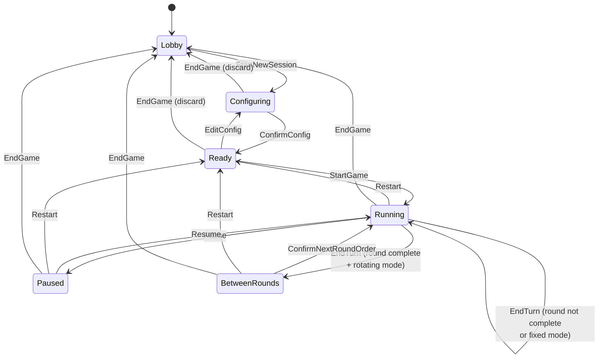

# 02 — Session Lifecycle

This document is the **authoritative** source for the session phase state machine. Every other spec file MUST refer to phase names exactly as defined here; no other file may introduce a new phase or redefine a transition.

## Phases

| Phase | Description |
| --- | --- |
| `Lobby` | Initial screen. No active session. Host may open Settings or start a new session. |
| `Configuring` | Host is editing the in-progress `GameConfig` for the upcoming game. Timers are not running. Config is mutable. |
| `Ready` | `GameConfig` has been confirmed and validated. The game has not started; all per-player clocks are at their initial values. Host may press Start, or press Edit Config to return to `Configuring`. |
| `Running` | The active player's clock is decreasing. The tick loop is advancing `remainingMs`. |
| `Paused` | The active player's clock is frozen. Host has explicitly paused. All other state is preserved. |
| `BetweenRounds` | **Only reachable when `config.turnOrderMode = 'rotating'`.** A round has just completed and the host is reordering the player list for the next round. Timers are not running. |

`Lobby`, `Configuring`, `Ready`, and `BetweenRounds` are non-ticking phases — the timer loop MUST NOT decrement any clock while in these phases. `Running` is the only ticking phase. `Paused` retains all clock values without ticking.

The "End Game" confirmation modal is a **client-only UI overlay** with no corresponding server phase; the server stays in its current phase until the host confirms, at which point `EndGame` is dispatched and the transition fires.

## Events

| Event | Payload | Semantics |
| --- | --- | --- |
| `StartNewSession` | — | Host clicks "Start new session" from the Lobby. Creates a fresh draft `GameConfig`. |
| `EditConfig` | full `GameConfig` (replacement) | Host replaces the entire draft config. The wire format is `PUT` (whole-object replace), not a partial patch. |
| `ConfirmConfig` | — | Host confirms the draft config; validation MUST pass (see `03-timer-config.md`). |
| `StartGame` | — | Host clicks "Start"; the first player's clock begins ticking. |
| `EndTurn` | `{ source: 'screen-tap' \| 'physical-button', expectedPlayerId? }` | The current turn ends; advance to next player or to `BetweenRounds` if the round is complete and `rotating`. `expectedPlayerId` is set by MQTT-sourced events to guard against stale presses. Round-completion is handled inline by the reducer; there is no separate `RoundComplete` event. |
| `ConfirmNextRoundOrder` | `playerIds: string[]` | Host has reordered players for the next round; reducer validates that the set of ids matches the configured players and then re-enters `Running` with the first player in the new order. |
| `Pause` | — | Freezes the active player's clock. |
| `Resume` | — | Unfreezes the active player's clock. |
| `Undo` | — | Pops one entry from the history stack (see `04-in-game-behavior.md`) and restores it. |
| `AdjustTime` | `{ playerId, deltaMs: number }` | Apply a signed delta to a player's `remainingMs`. |
| `DismissAlert` | `{ playerId }` | Clears a persistent timeout alert for one player. |
| `EndGame` | — | Host has chosen to end the game. Discards `GameConfig` and `GameState`. |
| `Restart` | — | Resets all clocks to initial values, keeps the confirmed `GameConfig`, returns to `Ready`. |

## Transition table

Rows are events; columns are current phases. A cell of `→ X` means transition to phase `X` after processing the event. **`→ X` where `X` equals the current phase column is a "no-op" — the event is accepted and its side effects are applied, but the phase does not change.** A cell of `—` means the event is rejected with HTTP 409 `invalid-phase`.

| Event \ Phase | `Lobby` | `Configuring` | `Ready` | `Running` | `Paused` | `BetweenRounds` |
| --- | --- | --- | --- | --- | --- | --- |
| `StartNewSession` | → `Configuring` | — | — | — | — | — |
| `EditConfig` | — | → `Configuring` | → `Configuring` | — | — | — |
| `ConfirmConfig` | — | → `Ready` (if valid) | — | — | — | — |
| `StartGame` | — | — | → `Running` | — | — | — |
| `EndTurn` | — | — | — | → `Running` or `BetweenRounds` (see below) | — | — |
| `ConfirmNextRoundOrder` | — | — | — | — | — | → `Running` |
| `Pause` | — | — | — | → `Paused` | — | — |
| `Resume` | — | — | — | — | → `Running` | — |
| `Undo` | — | — | — | → snapshot.phase | → `Paused` (state restored, phase override) | → snapshot.phase |
| `AdjustTime` | — | — | → `Ready` | → `Running` | → `Paused` | → `BetweenRounds` |
| `DismissAlert` | — | — | — | → `Running` | → `Paused` | — |
| `EndGame` | — | → `Lobby` (discards draft) | → `Lobby` | → `Lobby` | → `Lobby` | → `Lobby` |
| `Restart` | — | — | — | → `Ready` | → `Ready` | → `Ready` |

Notes:

- `Restart` is intentionally allowed from `Running`, `Paused`, and `BetweenRounds`. It is NOT allowed from `Lobby`, `Configuring`, or `Ready`, because there is no game in progress to restart.
- `EndGame` always returns to `Lobby` and discards the entire `GameState` including `GameConfig`. The next session starts from `Configuring` with a fresh draft.
- `EditConfig` from `Ready` reverts the phase to `Configuring`; the host must re-confirm.
- `AdjustTime`, `DismissAlert`, and `EditConfig` rows that show `→ <current phase>` are accepted no-ops at the phase level — they mutate state but do not change `state.phase`.

### `ConfirmConfig` resolution

When `ConfirmConfig` is accepted (validation per `03-timer-config.md` passes):

1. `state.config` = the confirmed draft.
2. `state.devicesSnapshot` = deep clone of `AppSettings.devices` at this instant.
3. `state.currentOrder` = `config.players.map(p => p.id)`.
4. `state.remainingMs` = `{ [p.id]: p.timeBudgetMs for each p in config.players }` — fully rebuilt; any prior keys (e.g. from a removed player after `EditConfig` from `Ready`) are dropped.
5. `state.currentPlayerIdx = null`.
6. `state.roundNumber = 0` (incremented to 1 by `StartGame`).
7. `state.turnStartedAt = null`.
8. `state.alerts = []`.
9. `state.history = []`.
10. `state.phase = 'Ready'`.

This rebuild is unconditional: it runs every time `ConfirmConfig` is accepted, including the case where the host pressed `EditConfig` from `Ready` and then re-confirmed without changes.

### `EndTurn` resolution

When `EndTurn` is received in `Running`:

1. Push a `TurnSnapshot` (see `05-data-model.md`) onto `state.history` with `phase = 'Running'`, capturing the current `(currentPlayerIdx, remainingMs, roundNumber, currentOrder)` and `takenAt = Date.now()`.
2. Compute `nextIdx = currentPlayerIdx + 1`.
3. If `nextIdx < currentOrder.length` — advance: `currentPlayerIdx = nextIdx`, reset `turnStartedAt = Date.now()`, stay in `Running`.
4. Else (round complete):
   - If `config.turnOrderMode === 'fixed'`: increment `roundNumber`, set `currentPlayerIdx = 0`, reset `turnStartedAt`, stay in `Running`.
   - If `config.turnOrderMode === 'rotating'`: increment `roundNumber`, transition to `BetweenRounds` (host MUST issue `ConfirmNextRoundOrder` to proceed).
5. In turn-by-turn mode, reset the new active player's `remainingMs` to `config.players[i].timeBudgetMs` at the moment they become active (see `04-in-game-behavior.md` for the canonical clock model).

### `Undo` resolution

`Undo` is allowed from `Running`, `Paused`, and `BetweenRounds`. It pops the most recent `TurnSnapshot` from `state.history` and restores:

- `state.currentPlayerIdx = snapshot.currentPlayerIdx`
- `state.remainingMs = snapshot.remainingMs` (whole map; existing keys not in the snapshot are dropped)
- `state.roundNumber = snapshot.roundNumber`
- `state.currentOrder = snapshot.currentOrder`
- `state.phase = snapshot.phase`, **except**: if the pre-Undo phase was `Paused`, `state.phase` stays `Paused` (the host paused before undoing; they expect to remain paused).
- `state.turnStartedAt`:
  - if resulting phase is `Running`, set to `Date.now()` so the restored active player's clock resumes from `snapshot.remainingMs[activePlayerId]`;
  - otherwise (`Paused` or `BetweenRounds`), set to `null`.
- `state.alerts`: remove every alert whose `raisedAt > snapshot.takenAt`. Alerts older than the snapshot are kept.

Two cases trace through cleanly:

- **Undo from `Running` after one or more `EndTurn`s in the current round:** the most recent snapshot has `phase = 'Running'`; the previous player becomes active again with the time they had at the end of their turn.
- **Undo from `BetweenRounds`:** the most recent snapshot is the one pushed by the `EndTurn` that completed the round (its `phase = 'Running'`). Undo therefore returns to `Running` with the last player of the just-completed round active again. The `BetweenRounds` prompt is dismissed.
- **Undo from `Running` after `ConfirmNextRoundOrder`:** the most recent snapshot is the one pushed at `ConfirmNextRoundOrder` (its `phase = 'BetweenRounds'`). Undo returns to `BetweenRounds` so the host can pick a different next-round order.

Undo when `state.history` is empty is rejected with HTTP 409 `nothing-to-undo`. Undo does NOT itself push a snapshot — see `04-in-game-behavior.md`.

## State diagram

## Restart vs End Game

| Aspect | Restart | End Game |
| --- | --- | --- |
| Final phase | `Ready` | `Lobby` |
| `GameConfig` | Preserved | Discarded (set to `null`) |
| `devicesSnapshot` | Preserved | Discarded (set to `[]`) |
| `remainingMs` | Reset to each player's `timeBudgetMs` | Cleared (`{}`) |
| `currentOrder` | Reset to `config.players.map(p => p.id)` | Cleared (`[]`) |
| `currentPlayerIdx` | `null` (set to 0 by a subsequent `StartGame`) | `null` |
| `roundNumber` | Reset to 0 (set to 1 by `StartGame`) | Cleared |
| `turnStartedAt` | `null` | `null` |
| `alerts` | Cleared (`[]`) | Cleared (`[]`) |
| `history` | Cleared (`[]`) | Cleared (`[]`) |
| Confirmation modal | Yes — destructive | Yes — destructive |
