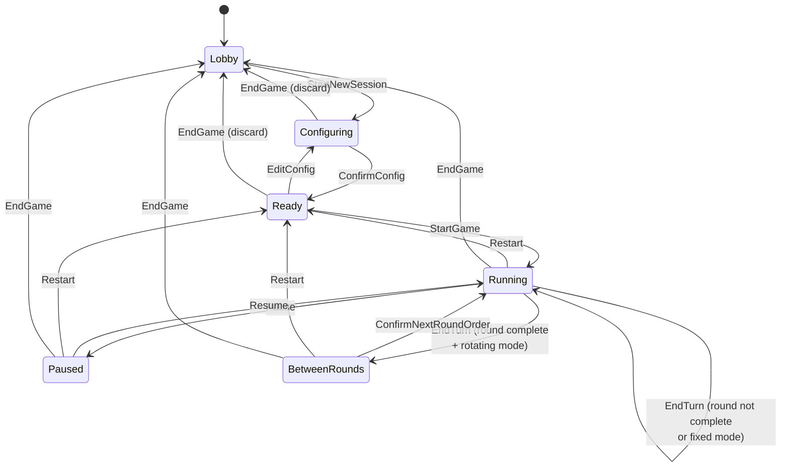

# 02 — Session Lifecycle

This document is the **authoritative** source for the session phase state machine. Every other spec file MUST refer to phase names exactly as defined here; no other file may introduce a new phase or redefine a transition.

## Phases

| Phase | Description |
| --- | --- |
| `Lobby` | Initial screen. No active session. Host may open Settings or start a new session. |
| `Configuring` | Host is editing the in-progress `GameConfig` for the upcoming game. Timers are not running. Config is mutable. |
| `Ready` | `GameConfig` has been confirmed and validated. The game has not started; all per-player clocks are at their initial values. Host may press Start, or press Edit Config to return to `Configuring`. |
| `Running` | The active player's clock is decreasing. The tick loop is advancing `remainingMs`. |
| `Paused` | The active player's clock is frozen. Host has explicitly paused. All other state is preserved. |
| `BetweenRounds` | **Only reachable when `config.turnOrderMode = 'rotating'`.** A round has just completed and the host is reordering the player list for the next round. Timers are not running. |
| `Ended` | The game has been terminated by the host. This phase is transient — the next event MUST be `EndGame` returning to `Lobby` (an "End-of-Game" confirmation screen is presented, see `08-ui-screens.md`). |

`Lobby`, `Configuring`, `Ready`, `BetweenRounds`, and `Ended` are non-ticking phases — the timer loop MUST NOT decrement any clock while in these phases. `Running` is the only ticking phase. `Paused` retains all clock values without ticking.

## Events

| Event | Payload | Semantics |
| --- | --- | --- |
| `StartNewSession` | — | Host clicks "Start new session" from the Lobby. Creates a fresh draft `GameConfig`. |
| `EditConfig` | partial `GameConfig` patch | Host updates one or more fields of the draft config. |
| `ConfirmConfig` | — | Host confirms the draft config; validation MUST pass (see `03-timer-config.md`). |
| `StartGame` | — | Host clicks "Start"; the first player's clock begins ticking. |
| `EndTurn` | `{ source: 'screen-tap' \| 'physical-button', expectedPlayerId? }` | The current turn ends; advance to next player or to `BetweenRounds` if the round is complete and `rotating`. `expectedPlayerId` is set by MQTT-sourced events to guard against stale presses. |
| `RoundComplete` | — | **Internal event,** emitted by the reducer when `EndTurn` would advance past the last player in the current round. Whether this maps to `Running` (in `fixed` mode) or `BetweenRounds` (in `rotating` mode) is decided by the reducer. |
| `ConfirmNextRoundOrder` | `playerIds: string[]` | Host has reordered players for the next round; reducer validates that the set of ids matches the configured players and then re-enters `Running` with the first player in the new order. |
| `Pause` | — | Freezes the active player's clock. |
| `Resume` | — | Unfreezes the active player's clock. |
| `Undo` | — | Pops one entry from the history stack (see `04-in-game-behavior.md`) and restores it. |
| `AdjustTime` | `{ playerId, deltaMs: number }` | Apply a signed delta to a player's `remainingMs`. |
| `DismissAlert` | `{ playerId }` | Clears a persistent timeout alert for one player. |
| `EndGame` | — | Host has chosen to end the game. Discards `GameConfig` and `GameState`. |
| `Restart` | — | Resets all clocks to initial values, keeps the confirmed `GameConfig`, returns to `Ready`. |

## Transition table

Rows are events; columns are current phases. A cell of `→ X` means transition to phase `X`. A cell of `—` means the event is rejected with HTTP 409 `invalid-phase`.

| Event \ Phase | `Lobby` | `Configuring` | `Ready` | `Running` | `Paused` | `BetweenRounds` |
| --- | --- | --- | --- | --- | --- | --- |
| `StartNewSession` | → `Configuring` | — | — | — | — | — |
| `EditConfig` | — | → `Configuring` | → `Configuring` | — | — | — |
| `ConfirmConfig` | — | → `Ready` (if valid) | — | — | — | — |
| `StartGame` | — | — | → `Running` | — | — | — |
| `EndTurn` | — | — | — | → `Running` or `BetweenRounds` (see below) | — | — |
| `ConfirmNextRoundOrder` | — | — | — | — | — | → `Running` |
| `Pause` | — | — | — | → `Paused` | — | — |
| `Resume` | — | — | — | — | → `Running` | — |
| `Undo` | — | — | — | → `Running` (state restored) | → `Paused` (state restored) | → `Running` (state restored, last turn re-opened) |
| `AdjustTime` | — | — | → `Ready` | → `Running` | → `Paused` | → `BetweenRounds` |
| `DismissAlert` | — | — | — | → `Running` | → `Paused` | — |
| `EndGame` | — | → `Lobby` (discards draft) | → `Lobby` | → `Lobby` | → `Lobby` | → `Lobby` |
| `Restart` | — | — | — | → `Ready` | → `Ready` | → `Ready` |

Notes:

- `Restart` is intentionally allowed from `Running`, `Paused`, and indirectly from `BetweenRounds` (the host first ends the round prompt and then restarts; equivalently, the UI MAY offer Restart directly from `BetweenRounds` — implementer's choice, surface in `08-ui-screens.md`). It is NOT allowed from `Lobby`, `Configuring`, or `Ready`, because there is no game in progress to restart.
- `EndGame` always returns to `Lobby` and discards the entire `GameState` including `GameConfig`. The next session starts from `Configuring` with a fresh draft.
- `EditConfig` after `Ready` reverts the phase to `Configuring`; the host must re-confirm.
- A single-shot **`Ended`** phase is not in the transition table because it is a sub-state of the End-of-Game confirmation modal in `Running`/`Paused`/`BetweenRounds` — `EndGame` transitions directly to `Lobby`. The `Ended` phase value exists only for the brief window between the host clicking "End Game" and confirming; if the host cancels the confirm, the phase remains unchanged.

### `EndTurn` resolution

When `EndTurn` is received in `Running`:

1. Snapshot current `(currentPlayerIdx, remainingMs, roundNumber, currentOrder, turnStartedAt)` and push onto `history` (see `04-in-game-behavior.md`).
2. Compute `nextIdx = currentPlayerIdx + 1`.
3. If `nextIdx < currentOrder.length` — advance: `currentPlayerIdx = nextIdx`, reset `turnStartedAt = Date.now()`, stay in `Running`.
4. Else (round complete):
   - If `config.turnOrderMode === 'fixed'`: increment `roundNumber`, set `currentPlayerIdx = 0`, reset `turnStartedAt`, stay in `Running`.
   - If `config.turnOrderMode === 'rotating'`: increment `roundNumber`, transition to `BetweenRounds` (host MUST issue `ConfirmNextRoundOrder` to proceed).
5. In turn-by-turn mode, reset the new active player's `remainingMs` to `config.players[i].timeBudgetMs` at the moment they become active (see `04-in-game-behavior.md` for the canonical clock model).

### `Undo` resolution

`Undo` is allowed from `Running`, `Paused`, and `BetweenRounds`. It pops the most recent `TurnSnapshot` and restores:

- `currentPlayerIdx`
- `remainingMs` (whole map)
- `roundNumber`
- `currentOrder`
- `turnStartedAt = Date.now()` for the restored active player so their clock continues from the snapshot value

If the snapshot was taken at a `ConfirmNextRoundOrder` step (i.e. it represents the end of round N, before round N+1's order was confirmed), restoring it from `BetweenRounds` is a no-op aside from re-opening the BetweenRounds prompt with the *previous* round's order, allowing the host to re-confirm differently. If the snapshot was taken at an `EndTurn` step, restoring it from `Running` rewinds the most recent turn switch. Undo from `Paused` keeps the phase as `Paused` (the timer remains frozen at the restored value). Undo when `history` is empty is rejected with HTTP 409 `nothing-to-undo`.

## State diagram

## Restart vs End Game

| Aspect | Restart | End Game |
| --- | --- | --- |
| Final phase | `Ready` | `Lobby` |
| `GameConfig` | Preserved | Discarded |
| `remainingMs` | Reset to each player's `timeBudgetMs` | Cleared |
| `roundNumber` | Reset to 1 | Cleared |
| `currentOrder` | Reset to `config.players.map(p => p.id)` | Cleared |
| `history` | Cleared | Cleared |
| Confirmation modal | Yes — destructive | Yes — destructive |
